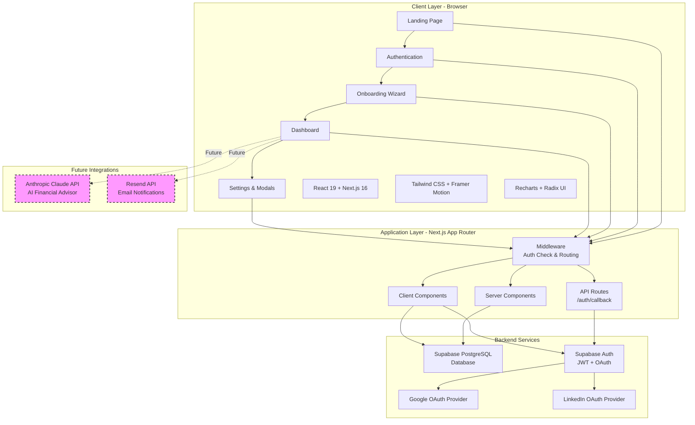
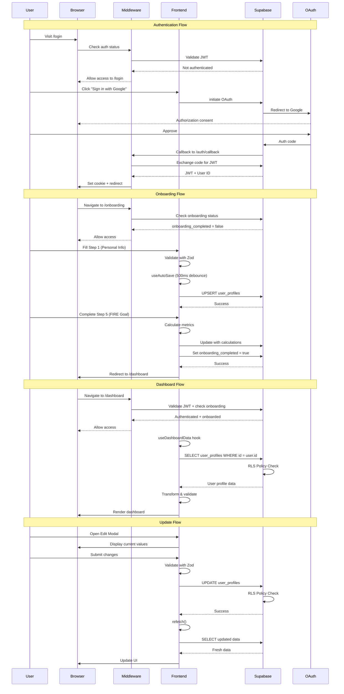
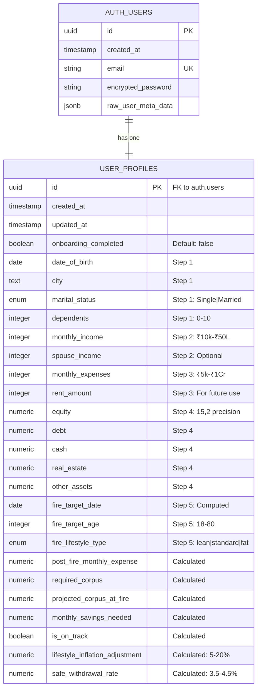
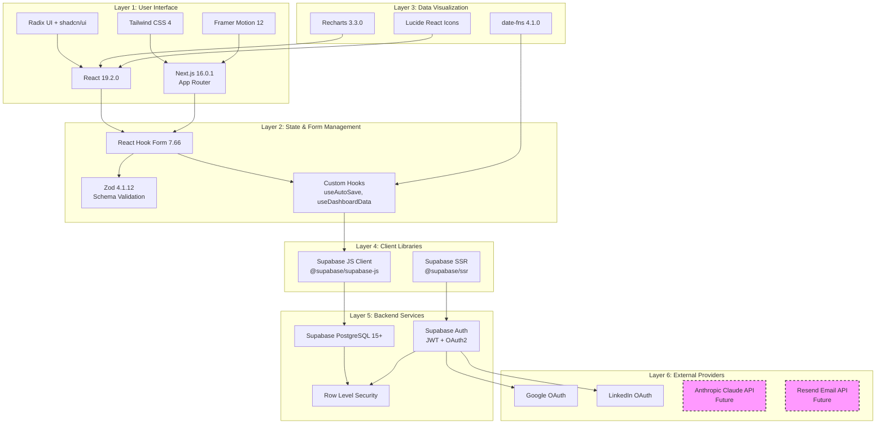
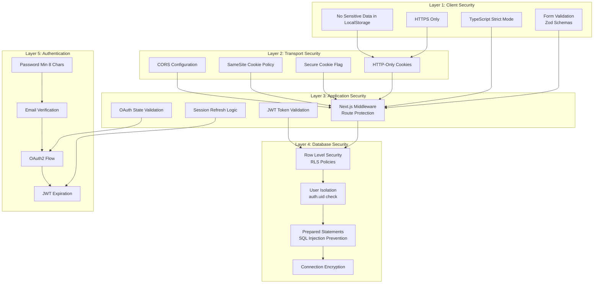
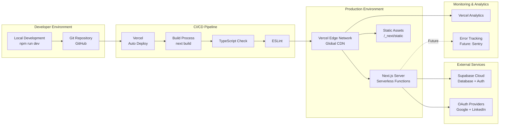
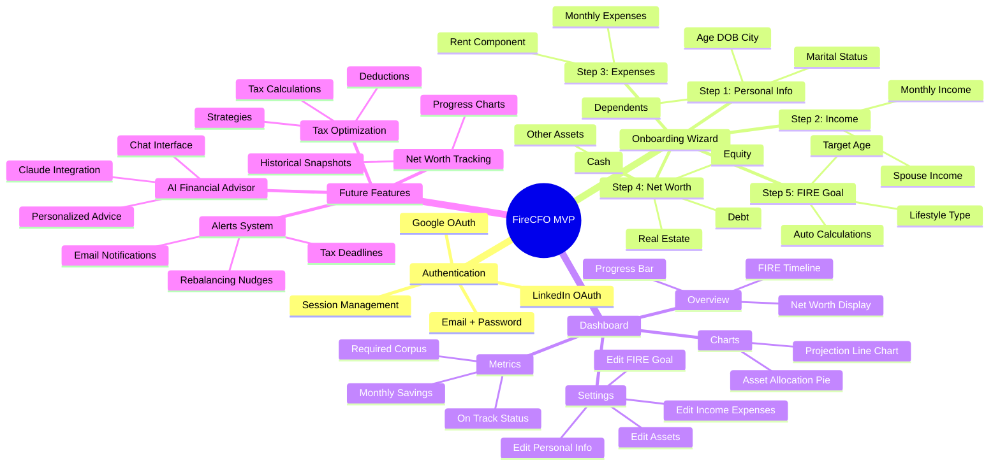

# FireCFO MVP - System Architecture Diagram

## High-Level Architecture Overview



## Detailed Component Architecture

```mermaid
graph TB
    subgraph "Frontend - Pages & Routes"
        A1["/app/page.tsx<br/>Landing Page"]
        A2["/app/login/page.tsx<br/>Login Page"]
        A3["/app/signup/page.tsx<br/>Signup Page"]
        A4["/app/onboarding/page.tsx<br/>5-Step Wizard"]
        A5["/app/dashboard/page.tsx<br/>FIRE Dashboard"]
        A6["/app/dashboard/settings/page.tsx<br/>Settings Page"]
    end

    subgraph "Frontend - Components"
        B1[LoginForm + SignupForm]
        B2[OnboardingSteps 1-5<br/>Personal, Income, Expenses,<br/>Net Worth, FIRE Goal]
        B3[DashboardOverview<br/>Progress Bar, Charts]
        B4[Edit Modals<br/>Personal, Income, Assets,<br/>FIRE Goal]
    end

    subgraph "Frontend - Hooks & State"
        C1[useAutoSave<br/>Debounced Save - 500ms]
        C2[useDashboardData<br/>Data Fetch & Refetch]
        C3[React Hook Form<br/>+ Zod Validation]
    end

    subgraph "Business Logic Layer"
        D1[FIRE Calculations<br/>LIA, SWR, Corpus]
        D2[Form Validation<br/>Zod Schemas]
        D3[Date & Currency Utils]
        D4[Scroll & Navigation]
    end

    subgraph "Authentication & Routing"
        E1[middleware.ts<br/>Route Protection]
        E2[/auth/callback/route.ts<br/>OAuth Handler]
        E3[lib/supabase.ts<br/>Singleton Client]
    end

    subgraph "Database Layer - Supabase"
        F1[(user_profiles Table<br/>UUID PK, 40+ columns)]
        F2[Row Level Security<br/>RLS Policies]
        F3[Auth Users Table<br/>JWT Management]
    end

    A1 --> E1
    A2 --> B1
    A3 --> B1
    A4 --> B2
    A5 --> B3
    A6 --> B4

    B1 --> E3
    B2 --> C1
    B2 --> C3
    B3 --> C2
    B4 --> C2

    C1 --> D1
    C1 --> E3
    C2 --> E3
    C3 --> D2

    D1 --> E3
    E1 --> E2
    E2 --> E3
    E3 --> F1
    E3 --> F3

    F1 --> F2
    F3 --> F2
```

## Data Flow Architecture



## Database Schema



## Technology Stack Layers



## Security Architecture



## Deployment Architecture



## Feature Module Map



## FIRE Calculation Flow

```mermaid
flowchart TD
    A[User Input Data] --> B{All Steps Complete?}
    B -->|No| C[Continue Onboarding]
    B -->|Yes| D[Calculate Current Age]

    D --> E[Years to FIRE = Target Age - Current Age]

    E --> F[Calculate Lifestyle Inflation Adjustment]
    F --> F1[Base: 8%]
    F1 --> F2[+ Age Factor: -2% to +3%]
    F2 --> F3[+ Dependents Factor: 0% to +5%]
    F3 --> F4[+ Savings Rate Factor: -5% to +5%]
    F4 --> F5[+ Lifestyle Type: -5% to +10%]
    F5 --> F6[Clamp: 5% to 20%]

    F6 --> G[Calculate Post-FIRE Monthly Expense]
    G --> G1[= Monthly Expenses × 1 + LIA]

    G1 --> H[Determine Safe Withdrawal Rate]
    H --> H1{Years to FIRE}
    H1 -->|≤ 10 years| H2[SWR = 3.5%]
    H1 -->|11-20 years| H3[SWR = 4.0%]
    H1 -->|> 20 years| H4[SWR = 4.5%]

    H2 --> I[Calculate Annual Post-FIRE Expenses]
    H3 --> I
    H4 --> I
    I --> I1[= Post-FIRE Monthly × 12]

    I1 --> J[Calculate Required Corpus]
    J --> J1[= Annual Expenses / SWR]
    J1 --> J2[× 1.06 ^ Years to FIRE<br/>Inflation Adjustment]

    J2 --> K[Calculate Current Net Worth]
    K --> K1[= Equity + Debt + Cash + Real Estate + Other]

    K1 --> L[Calculate Projected Corpus]
    L --> L1[= Current Net Worth × 1.12 ^ Years to FIRE<br/>12% Annual Growth]

    L1 --> M{Projected Corpus >= Required Corpus?}
    M -->|Yes| N[is_on_track = TRUE]
    M -->|No| O[is_on_track = FALSE]

    N --> P[Calculate Monthly Savings Needed]
    O --> P

    P --> P1[= Required Corpus - Projected Corpus]
    P1 --> P2[/ Months Remaining]
    P2 --> P3[If negative, set to 0]

    P3 --> Q[Save All Calculations to Database]
    Q --> R[Display Dashboard]

    style M fill:#ff9,stroke:#333,stroke-width:3px
    style N fill:#9f9,stroke:#333,stroke-width:2px
    style O fill:#f99,stroke:#333,stroke-width:2px
```

---

## Key Architectural Characteristics

### 1. **Architecture Pattern**
- **Monolithic** Next.js application with **Backend-as-a-Service (BaaS)** via Supabase
- **Client-Server** with serverless backend functions
- **Single Page Application (SPA)** with server-side routing

### 2. **Core Technologies**
| Layer | Technology | Version |
|-------|------------|---------|
| Frontend Framework | React | 19.2.0 |
| Meta Framework | Next.js (App Router) | 16.0.1 |
| Styling | Tailwind CSS | 4 |
| Database | Supabase (PostgreSQL) | 15+ |
| Authentication | Supabase Auth | - |
| Form Management | React Hook Form + Zod | 7.66 + 4.1 |
| Charts | Recharts | 3.3.0 |
| Animation | Framer Motion | 12.23 |

### 3. **Data Flow Pattern**
1. **User Input** → React Hook Form
2. **Validation** → Zod Schema
3. **Auto-Save** → useAutoSave hook (500ms debounce)
4. **API Call** → Supabase JS Client
5. **Database** → PostgreSQL with RLS
6. **Response** → Transform to TypeScript types
7. **UI Update** → React state + re-render

### 4. **Security Measures**
- **Authentication**: JWT tokens in HTTP-only cookies
- **Authorization**: Row Level Security (RLS) at database level
- **Transport**: HTTPS only, secure cookies
- **Validation**: Zod schemas + TypeScript strict mode
- **OAuth**: Server-side callback handler

### 5. **Performance Optimizations**
- **Debounced auto-save**: 500ms delay reduces DB calls
- **Singleton Supabase client**: Single instance prevents overhead
- **Client-side calculations**: Reduces server load
- **Server components**: Next.js optimizations
- **Edge deployment**: Vercel global CDN

### 6. **Scalability Considerations**
- **Serverless architecture**: Auto-scaling via Vercel
- **Managed database**: Supabase handles scaling
- **Stateless auth**: JWT tokens enable horizontal scaling
- **CDN delivery**: Static assets globally distributed

### 7. **Development Workflow**
```
Code Change → ESLint → TypeScript Check → Local Dev Server
     ↓
Git Commit → Push to GitHub
     ↓
Vercel Auto-Deploy → Build → Type Check → Deploy to Production
```

### 8. **Future Architecture Evolution**
- **AI Integration**: Anthropic Claude API for financial advice
- **Email System**: Resend API for notifications
- **Data Analytics**: Historical net worth tracking
- **Real-time Updates**: Supabase real-time subscriptions
- **Microservices**: Potential extraction of tax calculations or AI services

---

## File Structure Reference

```
firecfo-mvp/
├── app/                          # Next.js App Router
│   ├── auth/callback/route.ts   # OAuth callback handler
│   ├── login/page.tsx           # Login page
│   ├── signup/page.tsx          # Signup page
│   ├── onboarding/              # 5-step wizard
│   │   ├── page.tsx
│   │   ├── components/          # Step 1-5 components
│   │   ├── hooks/               # useAutoSave
│   │   ├── utils/               # FIRE calculations
│   │   └── types.ts             # Zod schemas
│   ├── dashboard/               # Main dashboard
│   │   ├── page.tsx
│   │   ├── components/          # Cards, charts, modals
│   │   ├── settings/page.tsx   # Settings page
│   │   ├── hooks/               # useDashboardData
│   │   ├── utils/               # Dashboard calculations
│   │   └── types.ts             # TypeScript types
│   ├── layout.tsx               # Root layout
│   ├── page.tsx                 # Landing page
│   └── globals.css              # Global styles
├── components/
│   ├── ui/                      # shadcn/ui components
│   └── auth/                    # Auth components
├── lib/
│   ├── supabase.ts              # Supabase client singleton
│   └── utils.ts                 # Utilities
├── middleware.ts                # Auth routing middleware
├── next.config.ts               # Next.js config
├── package.json                 # Dependencies
├── tsconfig.json                # TypeScript config
└── tailwind.config.ts           # Tailwind config
```

---

## Environment Variables

```env
# Supabase Configuration
NEXT_PUBLIC_SUPABASE_URL=https://xxxxx.supabase.co
NEXT_PUBLIC_SUPABASE_ANON_KEY=eyJxxx...

# Future Integrations
ANTHROPIC_API_KEY=sk-ant-xxx      # Claude AI
RESEND_API_KEY=re_xxxx             # Email notifications
```

---

## Summary

FireCFO MVP is a **full-stack financial planning web application** built with:
- **Modern React 19 + Next.js 16** for the frontend
- **Supabase** as Backend-as-a-Service for database and authentication
- **TypeScript** for type safety across the entire stack
- **Tailwind CSS** for responsive styling
- **OAuth 2.0** for seamless authentication
- **Client-side calculations** for FIRE metrics with database persistence
- **Row-Level Security** for data protection
- **Serverless deployment** on Vercel

The architecture is designed for rapid MVP development while maintaining scalability for future features like AI financial advising, tax optimization, and real-time notifications.

---

**Diagram Created**: 2025-11-20
**Version**: 1.0
**Application**: FireCFO MVP
**Architecture Type**: Monolithic SPA with BaaS
